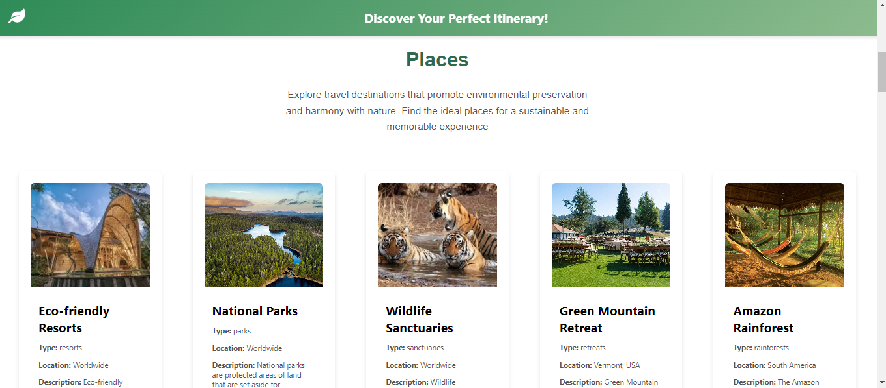
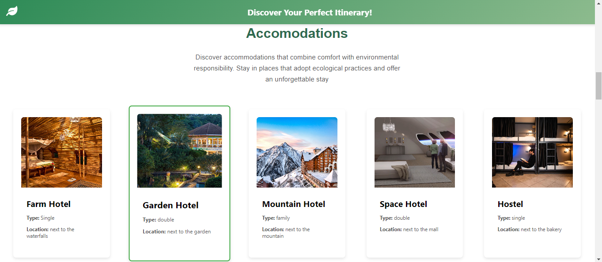
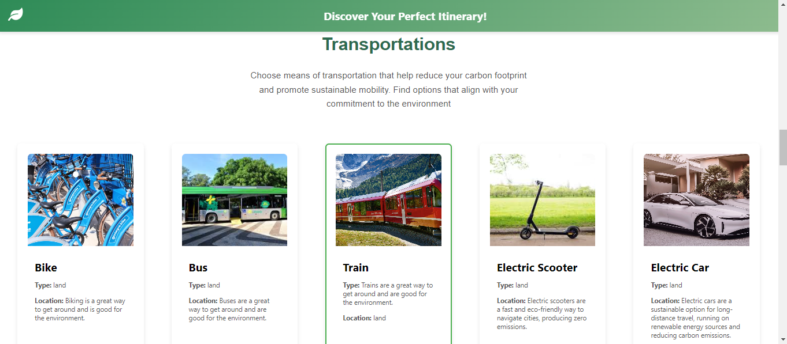
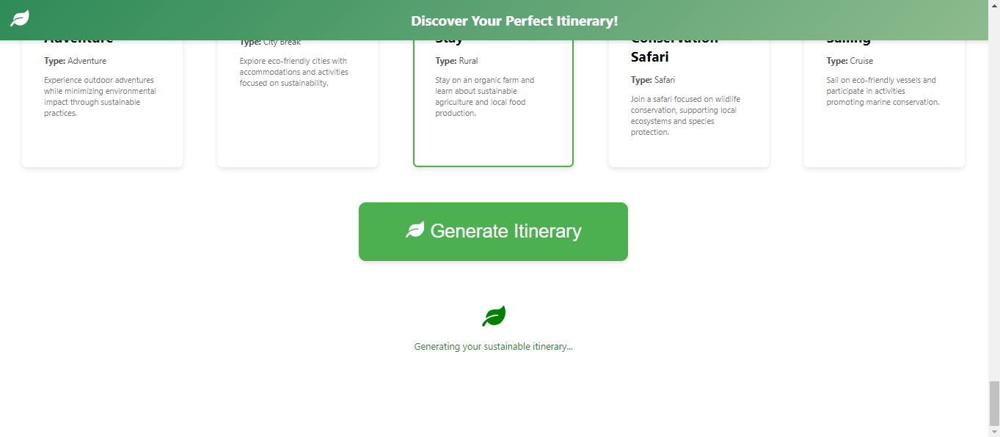
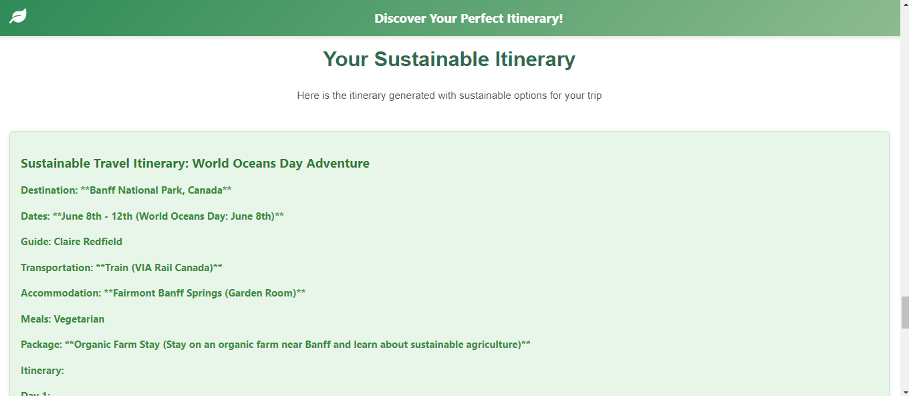
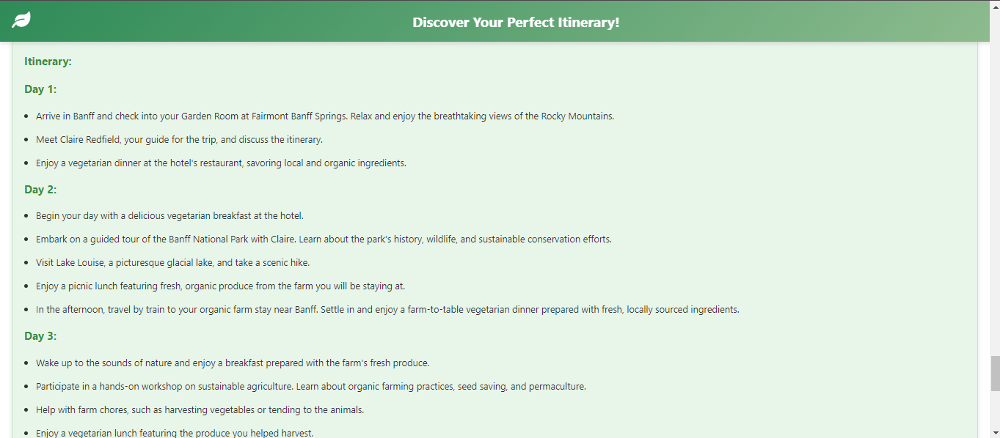

# 🌿 Sustainable Travel 

Descubra lugares e experiências incríveis enquanto planeja viagens sustentáveis com o poder da inteligência artificial. Nosso site ajuda você a criar itinerários personalizados e eco-friendly, sugerindo acomodações sustentáveis, meios de transporte ecológicos, restaurantes com práticas responsáveis e eventos voltados ao meio ambiente. Tenha uma experiência de viagem consciente, conectando-se com o planeta de uma forma única.

### 🖼️ ScreenShots









### 🎯 Funcionalidades

- Geração de itinerários sustentáveis personalizados;
- Seleção de acomodações, transportes, refeições, eventos e outros eco-friendly;
- Interface de usuário amigável e intuitiva;
- Uso de inteligência artificial para personalizar os resultados.

### 🚀 Uso

Para gerar um itinerário sustentável:

- Preencha os campos obrigatórios no formulário da aplicação;
- Clique no botão "Generate Itinerary";
- Aguarde 10 segundos para que a IA processe o itinerário;
- O itinerário será exibido na tela, pronto para uso.

### 🔧 Pré-requisitos

Antes de começar, você vai precisar ter instalado em sua máquina as seguintes ferramentas:

- Node.js

### 🛠️ Instalação

Siga os passos abaixo para rodar o projeto localmente:

- Clone o repositório:
    ```bash
    git clone https://github.com/GrazielleNascimento/Sustainable-travels-front.git
    ```

- Navegue até o diretório do projeto:
    ```bash
    cd sustainable-travel-itinerary
    ```

- Instale as dependências:
    ```bash
    npm install
    ```

- Inicie o projeto:
    ```bash
    npm run dev
    ```

### 🖥️ Tecnologias Utilizadas

- Frontend: React.js + Vite, Styled-Components;
- Backend: [API Travel-Sustainables](https://github.com/GrazielleNascimento/PDA-Travel-Sustainables) com Node.js + Vite e Express;
- API: [Google Gemini](https://ai.google.dev/gemini-api?gad_source=1&gclid=CjwKCAjwl6-3BhBWEiwApN6_khDQbZif5yejLVqkHZC6gKVFV2tfE-OxmhmbDL55HaVnKCAivrJIhhoC79MQAvD_BwE&hl=pt-br).
- Banco de Dados: Arquivo Json;

### 📚 Informações Gerais

- React [useState hook](https://reactjs.org/docs/hooks-state.html) utilizado para controlar os dados dos usuários e dos produtos;
- React [useEffect hook](https://reactjs.org/docs/hooks-effect.html) utilizado para carregar as telas com as informações dos produtos.

### 👧 Desenvolvido Por

[Grazielle Nascimento Ferreira](https://github.com/GrazielleNascimento)
